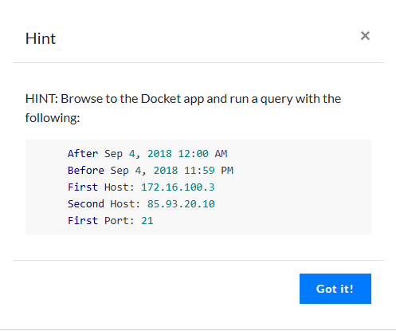
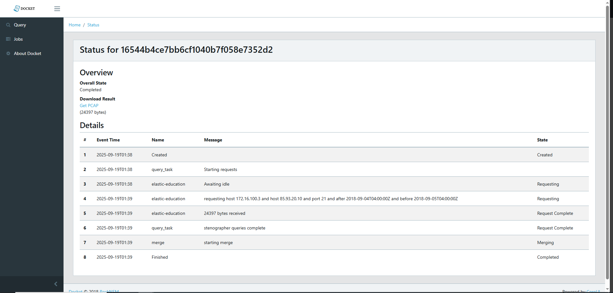
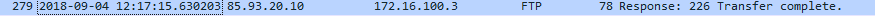
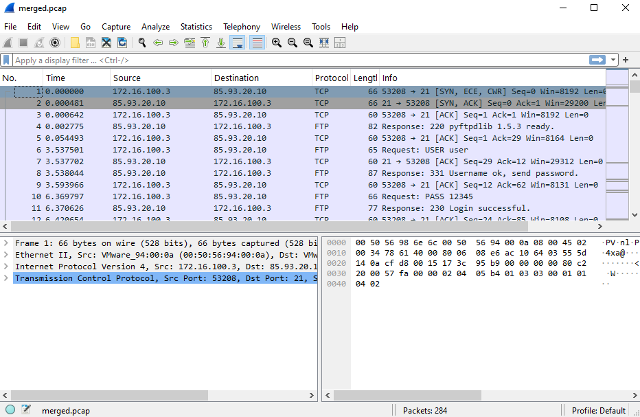
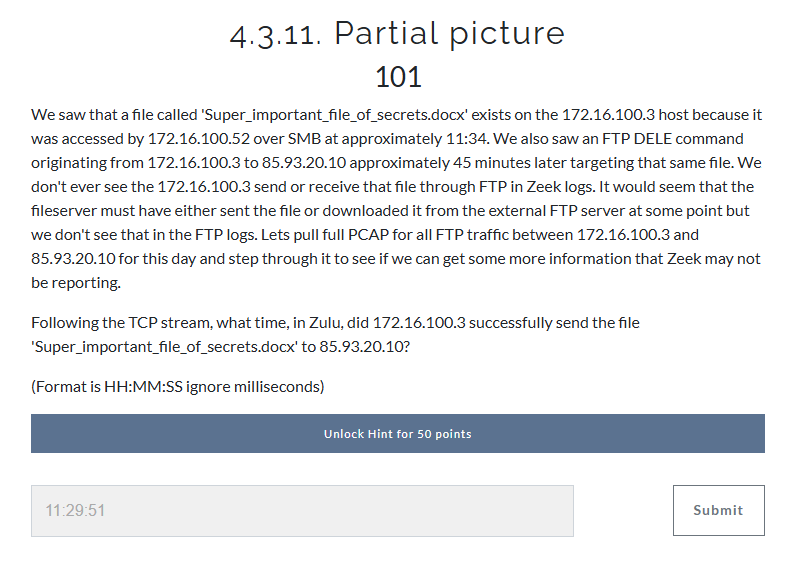
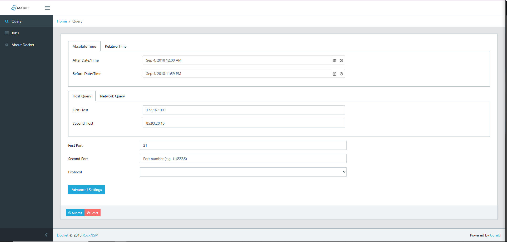

# FTP Data Exfiltration Investigation

## Overview

Comprehensive investigation of unauthorized file transfer to external infrastructure. This investigation demonstrates multi-tool analysis combining SIEM queries, network traffic analysis, and deep packet inspection to reconstruct a complete data exfiltration timeline.

## Scenario

A sensitive document (`Super_important_file_of_secrets.docx`) was accessed internally via SMB and subsequently exfiltrated to an external IP address via FTP. The investigation traced the file from initial access through external transfer, documenting the complete attack chain.

## Tools Used

- **Elastic SIEM** - Log correlation and event timeline analysis
- **Zeek** - Network traffic monitoring and protocol logging
- **Wireshark** - Deep packet analysis and PCAP investigation
- **Docket** - Targeted PCAP extraction and filtering

## Investigation Process

### 1. Initial Detection
- Identified SMB file access to sensitive document on host 172.16.100.3
- Observed FTP DELE command targeting the same file approximately 45 minutes later
- Destination: External IP 85.93.20.10

### 2. Network Traffic Analysis
Used Docket to extract targeted PCAP for FTP traffic between internal host and external IP:
- Time range: September 4, 2018 (full day)
- Source: 172.16.100.3
- Destination: 85.93.20.10
- Protocol: FTP (port 21)

### 3. Deep Packet Inspection
Analyzed PCAP in Wireshark to confirm file transfer:
- Followed TCP stream to reconstruct complete FTP session
- Identified FTP response code **226 (Transfer Complete)**
- Extracted precise timestamp from packet metadata

## Key Findings

**Attack Timeline:**
1. **11:34 UTC** - File accessed internally via SMB by host 172.16.100.52
2. **12:17:15 UTC** - File successfully exfiltrated via FTP to 85.93.20.10
3. **~12:62 UTC** - FTP DELE command issued (file deletion attempt)

**Exfiltration Details:**
- Internal Host: 172.16.100.3
- External IP: 85.93.20.10
- Protocol: FTP (unencrypted)
- File: Super_important_file_of_secrets.docx
- Transfer Status: Confirmed complete (FTP 226 response)
- Precise Timestamp: 12:17:15 Zulu (UTC)

## MITRE ATT&CK Mapping

- **T1041** - Exfiltration Over C2 Channel
- **T1048** - Exfiltration Over Alternative Protocol (FTP)
- **T1071** - Application Layer Protocol (FTP for data transfer)

## Technical Skills Demonstrated

✅ Multi-tool correlation (SIEM, Zeek, Wireshark)  
✅ Protocol analysis (SMB, FTP, TCP)  
✅ PCAP investigation and filtering  
✅ Timeline reconstruction with precise timestamps  
✅ Network forensics methodology  
✅ IOC extraction and documentation  
✅ MITRE ATT&CK framework mapping  

## Lessons Learned

- Zeek logs may not capture all FTP data transfer details - PCAP analysis was critical
- Correlating multiple data sources (SIEM + PCAP) provides complete attack visibility
- Precise timestamps in UTC format are essential for incident documentation
- FTP transfer completion codes (226) confirm successful exfiltration
- Understanding protocol behavior helps identify gaps in log visibility

## Deliverables

- Complete attack timeline from initial access to exfiltration
- PCAP analysis confirming file transfer
- IOC documentation (IPs, timestamps, protocols)
- MITRE ATT&CK technique mapping
- Forensic-quality timestamp documentation (Zulu format)

---

**Investigation Date:** September 2025 (Lab Environment)  
**Tools:** Elastic SIEM, Zeek, Wireshark, Docket  
**Analyst:** Paige Alfred
---
## Investigation Screenshots

### Lab Challenge Instructions

*Docket query parameters for targeted PCAP extraction*

### Docket PCAP Extraction Status

*PCAP extraction completed successfully - 24,397 bytes received*

### FTP Transfer Confirmation (12:17:15 UTC)

*Wireshark packet showing FTP response code 226 at exact timestamp*

### Wireshark PCAP Analysis

*Complete packet capture showing FTP session between internal host and external IP*

### Lab Challenge Context

*Investigation scenario and challenge question*

### Docket Query Configuration

*Docket interface showing host query parameters and time range selection*
